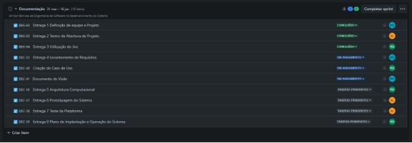
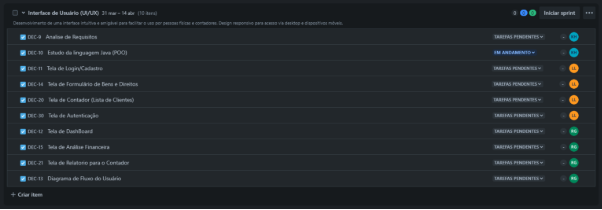
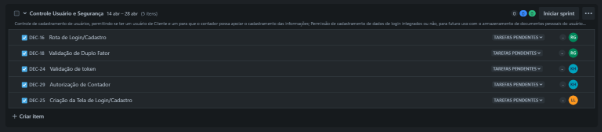
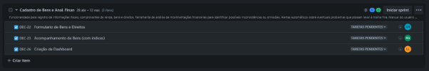
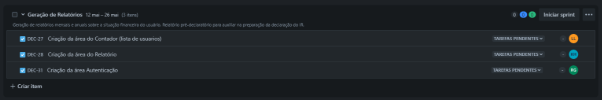
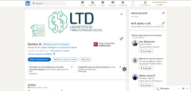

**Documentação do Sistema**

SUMÁRIO

[Dados do Cliente 2](#_346f99w4g96q)

[Equipe de Desenvolvimento 3](#_iamibefn8b8v)

[1. Introdução 4](#_wfl46ehpw4n8)

[2. Objetivo 5](#_8s7ghil1xctp)

[3. Escopo 6](#_bmwvbvpcm9jy)

[4. Backlogs do Produto 7](#_5r4dv5yycg0g)

[5. Cronograma 8](#_y5cga6tno7p1)

[6. Materiais e Métodos 9](#_lh0oan9fqytg)

[7. Resultados 10](#_306zhthg4bns)

[8. Conclusão 11](#_j9dvnskba15c)

[9. Homologação do MVP junto ao cliente 12](#_579mq2qqdirs)

[10. Divulgação 13](#_p1dqz4um8m5)

[11. Carta de Apresentação 15](#_zgbebyunypj7)

[12. Carta de Autorização 16](#_lnverlwta2a6)

[13. Relato individual do processo 18](#_rv4zuz9ppen0)

| <h1>**Dados do Cliente**</h1> |
| --------------------------------------------------------- |

Título do Projeto: **DeclaraJá**: Controle de Tangíveis e Mobilizáveis para Imposto de Renda

Cliente: Otranto Informática & Contabilidade

CNPJ/CPF: 62.591.557/0001-00

Contato: 193755-1110

Email do contato: paulo@otranto.com

| <h1>**Equipe de Desenvolvimento** </h1> |
| ------------------------------------------------------------------- |

|    **Nome completo**     | **Curso** |             **Disciplina**              |
| :----------------------: | :-------: | :-------------------------------------: |
|   Luca Silva Levanteze   |    ADS    | Programação Orientada a Objetos em Java |
| Kauã Hipólito Rodrigues  |    ADS    | Programação Orientada a Objetos em Java |
| Rafael dos Santos Giorgi |    ADS    | Programação Orientada a Objetos em Java |

| **Professor Orientador** |
| :----------------------: |
|  Kesede Rodrigues Julio  |

| <h1>1. **Introdução**</h1> |
| ------------------------------------------------------ |

O projeto consiste em um software com o objetivo de simplificar o processo de declaração do Imposto de Renda (IR) ao longo do ano. Para isso, o sistema auxiliará no controle de documentos e realizará análises da situação financeira do usuário, visando maior assertividade na declaração.

Um dos principais desafios nas declarações de IR é a ocorrência de malha fina, frequentemente causada pela falta de documentação, que pode ser interpretada como omissão de informações. Nosso sistema será desenvolvido para mitigar esse problema, permitindo que todos os bens e direitos do usuário sejam registrados no software de forma contínua. Adicionalmente, a realização de análises financeiras periódicas garantirá que, no momento da declaração, todos os documentos estejam em conformidade com as exigências da Receita Federal.

Para o desenvolvimento desta solução, serão utilizadas as seguintes tecnologias:

- Backend: Java;
- Banco de Dados: PostgreSQL;
- Frontend: React.js, HTML, CSS, JavaScript;
- Design UX/UI: Figma.

Em suma, o software tem como objetivo auxiliar o contribuinte na declaração do IR, prevenindo erros e, consequentemente, evitando a malha fina. Para alcançar esse objetivo, o sistema permitirá o registro contínuo de bens e direitos durante o ano, armazenando e organizando os documentos fiscais relevantes. Além disso, será responsável por realizar análises financeiras e identificar possíveis inconsistências, assegurando que o contribuinte esteja em conformidade com a Receita Federal antes do prazo final da declaração.

| <h1>2. **Objetivo**</h1> |
| ---------------------------------------------------- |

O objetivo é prever possível malha fina por falta de controle, perda de documentos ao longo do ano, tendo como foco a redução de erros na declaração do IR e autonomizando as pessoas, até o final do primeiro semestre de 2025.

| <h1>3. **Escopo**</h1> |
| -------------------------------------------------- |

O escopo principal deste projeto de software para simplificação da declaração do Imposto de Renda (IR) compreende os seguintes requisitos macro:

**1. Registro e Organização Contínua de Dados e Documentos Fiscais:**

- Implementação de funcionalidades para que o usuário possa registrar seus dados pessoais e dependentes, seus bens (imóveis, veículos, investimentos, etc.) e direitos ao longo do ano.
- Permitir o upload e armazenamento seguro de documentos fiscais relevantes (comprovantes de rendimentos, informes de instituições financeiras, notas fiscais de saúde, comprovantes de pagamento de educação, etc.), categorizando-os para fácil acesso.
- Fornecer mecanismos de organização e busca eficiente dos dados e documentos registrados, incluindo filtros por tipo, data e descrição.
- Possibilitar a edição e atualização dos dados e documentos registrados.
- Implementar um sistema de lembretes para prazos importantes relacionados à declaração do IR.
- Limite de Implementação: O sistema suportará os tipos de bens, direitos e documentos fiscais mais comuns exigidos pela Receita Federal para a declaração anual do IR. A integração automática com fontes externas de dados (como extratos bancários) não está prevista nesta fase inicial.

**2. Análise Financeira e Alerta de Inconsistências para Conformidade com a Receita Federal:**

- Implementação de algoritmos para analisar os dados financeiros inseridos pelo usuário, identificando possíveis inconsistências ou informações faltantes para a declaração do IR, como valores que não se encaixam em faixas esperadas ou campos obrigatórios não preenchidos.
- Geração de alertas e notificações para o usuário sobre potenciais problemas que possam levar à malha fina, explicando a possível causa da inconsistência e sugerindo ações para correção.
- Disponibilização de um painel de visão geral da situação fiscal do usuário ao longo do ano, facilitando o acompanhamento da conformidade com as normas da Receita Federal, incluindo gráficos e resumos dos dados financeiros relevantes.
- Integração de um módulo experimental que utiliza Inteligência Artificial (IA) para fornecer palpites e sugestões sobre possíveis bens e direitos que o usuário possa ter, com base nos dados inseridos e em padrões gerais. Este módulo indicaria, por exemplo, a possibilidade de declarar um determinado tipo de investimento ou despesa dedutível comum para perfis semelhantes. A viabilidade e precisão deste módulo ainda estão em avaliação.
- Limite de Implementação: As análises financeiras se basearam nos dados fornecidos diretamente pelo usuário e nas regras gerais de declaração do IR. O sistema não oferecerá consultoria tributária personalizada ou otimizações fiscais complexas além da identificação de inconsistências básicas. A IA será utilizada apenas para gerar sugestões não vinculativas, sem garantir a obrigatoriedade ou adequação da declaração.

| <h1>4. **Backlogs do Produto**</h1> |
| --------------------------------------------------------------- |

1. **Controle Usuário e Segurança:**

- Rota de Login/Cadastro - Criar o backend, tendo foco nas rotas de login e cadastro.

- Validação de Duplo Fator - Aqui será usado a ferramenta do Google Authenticator que fará a autenticação de duplo fato

- Validação de token\*\* - O token será uma forma de segurança que assim que o usuário se cadastrar o token autorizará seu acesso em sua devida seção.

- Autorização de Contador\*\* - Será desenvolvida uma pop-up para o contador autorizar um cliente, assim o contador com suas finanças.

- Criação da Tela de Login/Cadastro\*\* - Criação do Front-End, com foco na parte de login e cadastro, porém terá dois tipos de cadastro onde um é do cliente e outro do contador

1. **Cadastro de Bens e Análise Financeira:**

- Formulário de Bens e Direitos\*\* - Nesta tela, haverá um formulário para o usuário preencher, contendo cada dado que ele precisa importar para o software, para armazenamento e análise futura pelo contador.

- Acompanhamento de Bens (com índices)\*\* - Nesta tela, o contador analisará os dados inseridos pelo usuário e acompanhará seu comportamento!

- Criação da Dashboard\*\* - Esta será a tela principal para o usuário, pois nesta seção será onde o usuário terá uma visão geral dos bens que ele cadastrou no software, design e informações intuitivas

1. **Geração de Relatórios:**

- Criação da área do Contador (lista de usuários) - Essa tela irá listar todas as notificações aceitas pelo contador, para ele fazer uma avaliação do usuário com base em no relatório que o mesmo gerou

- Criação da área do Relatório - Será uma área exclusiva para o contador contratado acessar e analisar o relatório gerado pelo usuário com base em seus bens.

- Criação da área Autenticação - Nessa área o usuário cliente pode estar escolhendo qual contador ele gostaria de estar sendo acompanhado

| <h1>5. **Cronograma**</h1> |
| ------------------------------------------------------ |

| <h1>6. **Divulgação**</h1> |
| ----------------------------------------------------- |

1. **Linkedin do Projeto**

|  | www.linkedin.com/in/declara-já |
| :----------------------------------------------------------------------- | :----------------------------: |
